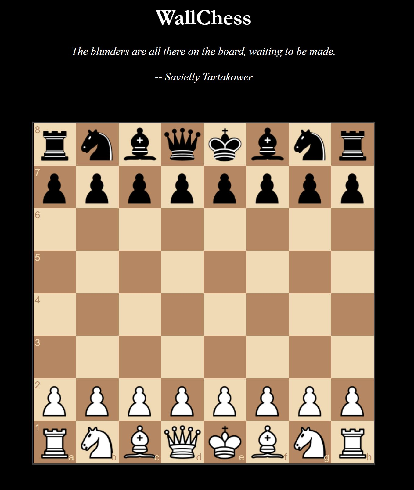

# chessAI - A playable chess engine in browser.

Chess engine/interface created using an implementation of the minimax algorithm with alpha-beta pruning and transposition tables.

See valuator.py for position evaluation.





TO DO
-----
* Add more opening theory and development.
* Iterative deepening and improved transposition tables
* Test using lichess API for ELO rating.
* Optimise minimax efficiency further.
* Optimise piece-square valuation and piece valuation for opening and middle/endgame.
* Look into Quiescence search and horizon effect.
* Look into negamax or MTD(f)
* Look into Monte Carlo tree search.
* Look into using bitboards and neural networks
* Fix quote dissapearing
* Implement chess.js for legal move checking or just use backend (likely faster to use js).


Usage
-----
```
pip3 install chess flask 
# then...
python3 app.py  # runs webserver on localhost:5000
```
 


