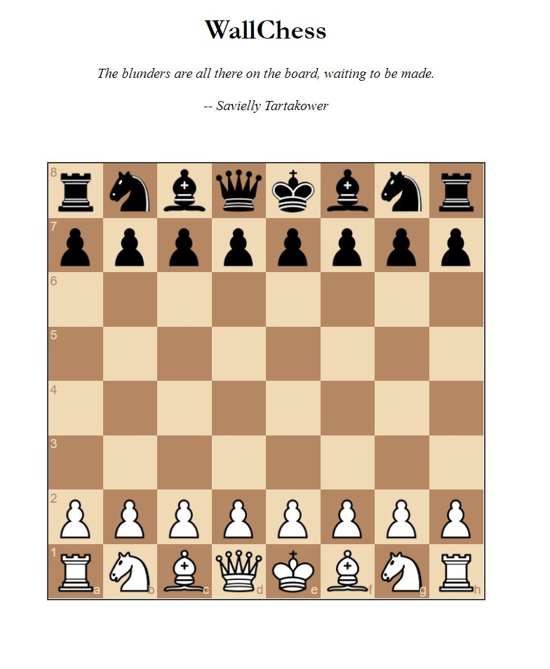

# chessAI

Python chess AI vs human player.

TO DO
-----
* Fix quote dissapearing
* Add color to front end
* Implement chess.js for legal move checking or just use backend (likely faster to use js).
* Fix minimax (best_move not being chosen, value is correct I think).

Optimisations
-----
* Caching for FEN strings in a map with key, val = fen and other info, valuation.
* Have a seperate cache for minimising and maximising players.
* Opening theory 
* Positional valuation (center = more powerful)
* Alpha beta pruning 

